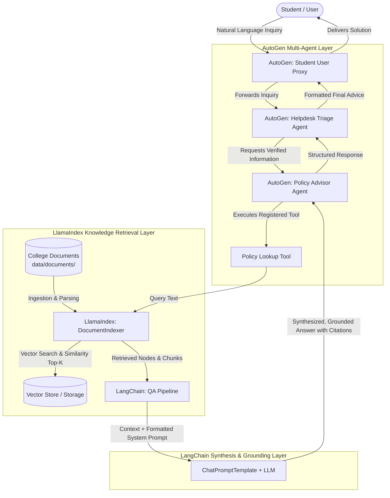

# 🎓 AI-Based Student Helpdesk

An intelligent, multi-agent campus advisory and helpdesk system combining **AutoGen**, **LlamaIndex**, and **LangChain** to provide grounded, policy-accurate answers to student inquiries.

---

## 📖 Overview

Navigating university administration—from hall ticket approvals and medical condonation to course add/drop windows and transfer certificates—often leaves students confused by disparate circulars and procedures.

The **AI-Based Student Helpdesk** streamlines this process by:
- Indexing official institutional policy documents.
- Employing multi-agent conversation workflows to understand intent and handle complex student cases.
- Grounding answers strictly within university regulations to eliminate hallucinations.
- Providing direct procedural steps, ERP paths, fee structures, deadlines, and department contact info.

---

## 🏛️ Tri-Framework Architecture

The system coordinates three specialized frameworks, creating an end-to-end multi-agent retrieval pipeline:



### Framework Roles:
1. **AutoGen (Multi-Agent Orchestration):**
   - Manages role-based multi-agent collaboration.
   - `Student_Proxy`: Emulates the student perspective and manages termination criteria.
   - `Helpdesk_Triage_Agent`: Clarifies the domain (exams, fees, attendance, certificates) and directs the workflow.
   - `Policy_Advisor_Agent`: High-level domain expert equipped with tools to query the official knowledge base.
2. **LlamaIndex (Document Ingestion & Retrieval):**
   - Parses Markdown and text policy documents with `SimpleDirectoryReader`.
   - Embeds policy chunks and persists indices to the `./storage` directory using `VectorStoreIndex`.
   - Performs semantic similarity retrieval with metadata preservation (file name, section headers).
3. **LangChain (Prompt Engineering & Response Synthesis):**
   - Formulates strict grounding prompts that instruct the LLM to only answer based on official documents.
   - Formats structured answers including *Direct Summary*, *Key Regulations & Thresholds*, *Action Steps (ERP & Counters)*, and *Official Document Citations*.

---

## 📂 Project Directory Structure

```text
AI-Based-Student-Helpdesk/
│
├── data/
│   └── documents/                             # Knowledge base of university policies
│       ├── attendance_rules.md                # 75% rule, medical condonation, OD leave
│       ├── bonafide_certificate_policy.md     # Steps, valid IDs, counter submission, tatkal
│       ├── course_registration.md             # CBCS credit limits, add/drop windows, MOOCs
│       ├── exam_regulations.md                # Registration, hall tickets, fee clearance, malpractice
│       ├── fee_structure_and_refund.md        # Tuition slabs, payment modes, withdrawal refunds
│       ├── library_guide.md                   # Hours, borrowing quotas, renewals, overdue fines
│       └── transfer_certificate_policy.md     # 7-department no-dues clearance, timelines
│
├── src/
│   ├── __init__.py                            # Package initializer
│   ├── indexer.py                             # LlamaIndex document reader & vector storage
│   ├── qa_pipeline.py                         # LangChain prompt formatting & answer synthesis
│   └── agent_coordinator.py                   # AutoGen agents, tool registration & chat workflow
│
├── tests/
│   ├── __init__.py
│   └── test_queries.py                        # Pytest suite validating policies and pipelines
│
├── .env.example                               # Environment configuration template
├── .gitignore                                 # Git ignore patterns for venv, storage, caches
├── requirements.txt                           # Project dependencies
├── app.py                                     # Interactive CLI application
└── README.md                                  # Documentation and architecture guide
```

---

## 📚 Knowledge Base Documents

All documents are located in `data/documents/` and represent realistic, detailed college regulations:

| Document | Key Policies Covered |
| :--- | :--- |
| **`bonafide_certificate_policy.md`** | ERP request steps, required IDs (Smart ID, Aadhaar), 2-day standard vs. 4-6 hr Tatkal timeline, ₹50-₹150 fees. |
| **`exam_regulations.md`** | Mandatory 75% attendance and zero-fee dues condition, hall ticket release 5 days prior, malpractice categories. |
| **`attendance_rules.md`** | 75% minimum threshold, 65%–74% medical condonation with CMO endorsement, On-Duty (OD) sports/conference leave. |
| **`fee_structure_and_refund.md`** | Tuition slabs per branch, ERP/UPI/NEFT Virtual Accounts, statutory withdrawal refund slabs (100% to 0%). |
| **`library_guide.md`** | Working hours (up to midnight during exams), borrowing limits (UG: 4 books, 14 days), ₹5-₹25/day overdue fines. |
| **`course_registration.md`** | Minimum/maximum semester credits (16-26 credits), 3 registration phases, Day 10 Add/Drop deadline, NPTEL transfer. |
| **`transfer_certificate_policy.md`** | 7 mandatory No-Dues signoffs (Lab, Library, Finance, Hostel, Sports, T&P, NSS), 5-7 day timeline, caution deposit refund. |

---

## 🚀 Setup & Installation Instructions

### 1. Prerequisites
- Python 3.10, 3.11, or 3.12 installed on your system.
- An OpenAI API Key (or compatible API key for an LLM provider).

### 2. Clone Repository & Setup Virtual Environment
```bash
# Clone the repository
git clone https://github.com/Rishi2508/AI-Based-Student-Helpdesk.git
cd AI-Based-Student-Helpdesk

# Create virtual environment
python -m venv venv

# Activate virtual environment
# Windows (PowerShell):
.\venv\Scripts\Activate.ps1
# Windows (Command Prompt):
.\venv\Scripts\activate.bat
# Linux / macOS:
source venv/bin/activate
```

### 3. Install Dependencies
```bash
pip install -r requirements.txt
```

### 4. Configure Environment Variables
Copy `.env.example` to `.env` and supply your API key:
```bash
cp .env.example .env
```
Edit `.env`:
```ini
OPENAI_API_KEY=sk-...your-actual-api-key...
OPENAI_MODEL_NAME=gpt-4o-mini
EMBEDDING_MODEL_NAME=text-embedding-3-small
STORAGE_DIR=./storage
DOCUMENTS_DIR=./data/documents
```

---

## 💻 Usage

### 1. Interactive Helpdesk Mode
Launch the interactive student chat interface:
```bash
python app.py
```
*Ask questions such as:*
- "How do I apply for a bonafide certificate for my passport?"
- "What happens if my attendance is 68% due to dengue?"
- "What are the overdue fines for library books?"
- "How does the no-dues clearance work for transfer certificates?"

### 2. Single Query Mode
Execute a query directly from the terminal:
```bash
python app.py --query "What is the last date to add or drop a course?"
```

### 3. AutoGen Multi-Agent Mode
Run the inquiry through the full collaborative multi-agent workflow:
```bash
python app.py --agents --query "I lost my college ID and exams start tomorrow. What documents do I need for my hall ticket?"
```

### 4. Inspect Knowledge Base Documents
List all available documents and their file sizes:
```bash
python app.py --list-docs
```

### 5. Rebuild Vector Index
Force index regeneration after updating documents in `data/documents/`:
```bash
python app.py --rebuild
```

---

## 🧪 Running Tests

A comprehensive test suite is provided to validate document presence, policy clauses, indexer logic, and pipeline components:

```bash
pytest -v
```

---

## 📄 License
This project is open-source and licensed under the [MIT License](LICENSE).
