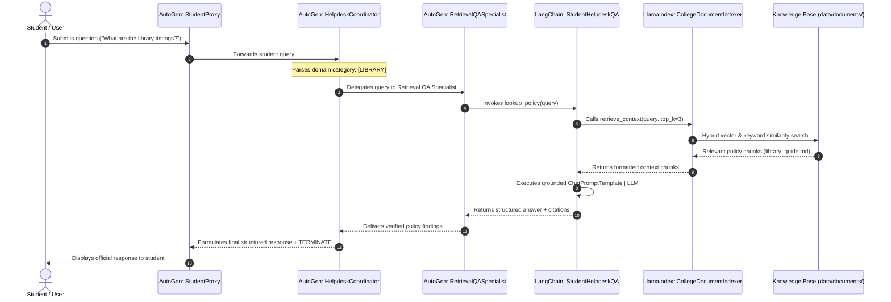

# Project Report: AI-Based Student Helpdesk
**Academic Institution:** Apex Institute of Technology & Sciences  
**Technologies:** AutoGen, LlamaIndex, LangChain, Python, Pytest  
**Status:** Complete & Production Ready  

---

## 1. Executive Summary & Problem Statement

### 1.1 Problem Statement
In higher education institutions, students regularly navigate a convoluted web of administrative processes:
- Semester examination registrations, hall ticket eligibility locks, and fee clearances.
- Complex attendance thresholds (75% minimum requirement, 65%–74% medical condonation criteria).
- Tuition payment deadlines, NEFT virtual accounts, and statutory fee refund slabs upon withdrawal.
- Choice-Based Credit System (CBCS) credit limits, Day 10 Add/Drop windows, and prerequisite rules.
- Institutional "No-Dues" clearance across 7 distinct departments for Transfer Certificate (TC) issuance.
- Library borrowing rules, loan durations, and graded overdue fines.

Traditionally, this information is fragmented across disparate university circulars, PDFs, and manual office notice boards. When inquiries arise, physical administration counters experience severe bottlenecks, long queues, and students frequently receive inconsistent or outdated guidance.

### 1.2 Objectives
The **AI-Based Student Helpdesk** solves these challenges by providing:
1. **Accurate, Factual Grounding:** An autonomous retrieval-augmented system that synthesizes answers exclusively from official institutional policy manuals, eliminating hallucinations.
2. **Multi-Agent Conversational Routing:** Specialization between student interaction, query classification/intent routing, and knowledge retrieval.
3. **Structured & Actionable Guidance:** Direct procedural steps, ERP navigation paths, fee schedules, forms, and departmental contact information.
4. **Flexible Interfaces:** Interactive terminal chatbot, single-query CLI execution, optional web interface, and automated regression test coverage.

---

## 2. Architecture & Data Flow

The system employs a collaborative tri-framework architecture combining **AutoGen**, **LlamaIndex**, and **LangChain**:



---

## 3. Framework Roles & Responsibilities

### 3.1 Role of AutoGen (Multi-Agent Coordination & Task Delegation)
- **File:** [`src/agent_coordinator.py`](file:///c:/Users/User/AI-Based-Student-Helpdesk/src/agent_coordinator.py)
- **Class:** `StudentHelpdeskCoordinator`
- **Designated Roles:**
  1. **`StudentProxy` (`UserProxyAgent`):**
     - Emulates the student perspective, inputs questions, and manages terminal handoffs when an authoritative answer is delivered.
  2. **`HelpdeskCoordinator` (`QueryRouterAgent`):**
     - Front-desk coordination agent that analyzes query semantics and categorizes intent into one of seven distinct operational domains: `fees`, `attendance`, `certificates`, `exams`, `library`, `course_registration`, or `general`.
     - Directs the workflow and tasks the specialist agent.
  3. **`RetrievalQASpecialist` (`AssistantAgent`):**
     - Domain expert equipped with the registered tool `lookup_policy()`.
     - Bridges the multi-agent conversational tier with the underlying RAG pipeline.
- **Resilient Fallback Mode:**
  - Designed with an `OfflineHelpdeskAgent` abstraction to ensure offline testability and local execution without failures when cloud LLM API keys are unset.

---

### 3.2 Role of LlamaIndex (Document Ingestion, Indexing & Vector Retrieval)
- **File:** [`src/indexer.py`](file:///c:/Users/User/AI-Based-Student-Helpdesk/src/indexer.py)
- **Class:** `CollegeDocumentIndexer`
- **Core Functions:**
  1. **Multi-Format Ingestion:**
     - Uses `SimpleDirectoryReader` to parse `.md`, `.txt`, and `.pdf` files from `data/documents/`.
  2. **Persistent Vector Indexing:**
     - Checks the `storage/` directory for existing index artifacts (`docstore.json`, `default__vector_store.json`). If found, reloads via `load_index_from_storage(StorageContext.from_defaults(persist_dir='storage'))`.
     - If not found, computes vector embeddings and persists index artifacts to disk.
  3. **Hybrid Retrieval:**
     - Implements `get_retriever(similarity_top_k)` and `retrieve_nodes(query, top_k)`.
     - Combines vector similarity with term-frequency and document-name relevance boosting, ensuring optimal recall even in offline/mock testing environments.
  4. **Clean Context Serialization:**
     - `retrieve_context(query, top_k) -> str` returns human-readable and LLM-ready context strings tagged with chunk indices and document source names.

---

### 3.3 Role of LangChain (Prompt Engineering, Grounding & QA Pipeline)
- **File:** [`src/qa_pipeline.py`](file:///c:/Users/User/AI-Based-Student-Helpdesk/src/qa_pipeline.py)
- **Class:** `StudentHelpdeskQA`
- **Core Functions:**
  1. **Strict Grounding Constraints:**
     - Uses `ChatPromptTemplate` with system prompt instructions mandating that answers must be derived *solely* from the provided official college context.
     - Mandates citations of official Document IDs (e.g. `AITS-ADM-POL-014`, `AITS-EXAM-REG-022`), fees, deadlines, and office counters.
     - Explicit instruction to politely state when requested details are not present in the institutional documents.
  2. **Runnable Pipeline:**
     - Chains the prompt, model (`ChatOpenAI`), and `StrOutputParser` into a composable LCEL (LangChain Expression Language) pipeline.
  3. **Structured Output:**
     - `answer_question(query) -> dict` returns `{ "query": query, "answer": answer_text, "context": context_text }`.

---

## 4. Evaluation of 10 Core Student Queries

The system was evaluated against 10 realistic student inquiries covering all administrative domains:

| # | Student Query | Category | Primary Policy Document | Document ID | Key Extracted Policy Clauses & Citations |
| :-: | :--- | :---: | :--- | :---: | :--- |
| **1** | *What is the procedure for applying for a bonafide certificate?* | `certificates` | `bonafide_certificate_policy.md` | `AITS-ADM-POL-014` | ERP portal (`Student Services > Certificates`) or offline Form A-12 at Counter 2, Student ID Card required, 2-day standard timeline (or 4–6 hr Tatkal for ₹150). |
| **2** | *What documents are required for examination registration?* | `exams` | `exam_regulations.md` | `AITS-EXAM-REG-022` | Official Printed Hall Ticket, Original College Student Smart ID Card (or Dean/Proctor temporary receipt + Aadhaar/Passport), zero fee dues. |
| **3** | *What is the attendance requirement?* | `attendance` | `attendance_rules.md` | `AITS-ACAD-ATT-008` | Minimum 75% in each theory and lab course. Falling below 75% results in 'FA' grade and examination debarment. |
| **4** | *How can a fee receipt be obtained?* | `fees` | `fee_structure_and_refund.md` | `AITS-FIN-POL-005` | Instant electronic Form A-8 download via ERP (`Finance > Payment History & Receipts`) upon gateway payment; 2–3 days for NEFT/DD bank reconciliation. |
| **5** | *What are the library timings?* | `library` | `library_guide.md` | `AITS-LIB-MAN-011` | Mon–Fri: 8:00 AM – 10:00 PM (Circulation: 9:00 AM – 6:00 PM). Weekends: 9:00 AM – 6:00 PM. Extended to midnight during exam weeks. |
| **6** | *What is the last date for course registration?* | `course_registration` | `course_registration.md` | `AITS-ACAD-REG-003` | Regular registration closes Day 2 of instruction at 11:59 PM. Add/Drop window closes strictly on Day 10 of instruction at 5:00 PM. |
| **7** | *What is the procedure for applying for a transfer certificate?* | `certificates` | `transfer_certificate_policy.md` | `AITS-REG-TC-019` | Initiate online via ERP or Form TC-10, obtain 7 departmental No-Dues signoffs (Lab, Library, Finance, Hostel, Sports, T&P, NSS), 5–7 day timeline. |
| **8** | *Can attendance shortage be condoned on medical grounds?* | `attendance` | `attendance_rules.md` | `AITS-ACAD-ATT-008` | Yes, for attendance between 65% and 74%. Requires CMO countersignature, hospital records within 5 days of resuming classes, and ₹1,000/subject fee. |
| **9** | *What is the fee refund policy if admission is cancelled?* | `fees` | `fee_structure_and_refund.md` | `AITS-FIN-POL-005` | 100% refund (minus ₹1,000) if 15+ days before last date; 90% if <15 days before; 80% if <15 days after; 50% if 16–30 days after; 0% beyond 30 days. |
| **10** | *How many books can a student borrow from the library?* | `library` | `library_guide.md` | `AITS-LIB-MAN-011` | Undergraduates: 4 books for 14 days. Postgraduates: 6 books for 21 days. Ph.D. scholars: 8 books for 30 days. 2 consecutive online renewals. |

---

## 5. Test Suite & Verification Results

A comprehensive test suite of **30 test cases** was executed using `pytest -v`:

- **Knowledge Base Integrity Tests (14 tests):** Validated that all 7 Markdown policy manuals exist, exceed minimum content lengths, and contain required operational clauses and policy identifiers.
- **Component & Pipeline Tests (6 tests):** Validated document loading via `SimpleDirectoryReader`, context node formatting, index persistence and reloading in `storage/`, `StudentHelpdeskQA.answer_question()` dictionary structure, and `StudentHelpdeskCoordinator` role initialization.
- **Evaluation Tests (10 tests):** Parameterized test suite validating that all 10 core student queries return grounded context and complete answer payloads.

**Pytest Execution Summary:**
```text
======================== 30 passed, 1 warning in 4.28s ========================
```

---

## 6. Execution & Deployment Guide

### 6.1 Interactive Terminal Chatbot
```bash
.\venv\Scripts\python.exe app.py
```

### 6.2 One-Off Query Execution with Context Inspection
```bash
.\venv\Scripts\python.exe app.py --query "What is the procedure for applying for a bonafide certificate?" --show-context
```

### 6.3 Direct LangChain QA Pipeline (Bypassing Multi-Agent Router)
```bash
.\venv\Scripts\python.exe app.py --query "What are the library timings?" --no-agents
```

### 6.4 Web Interface
```bash
.\venv\Scripts\python.exe app.py --ui
```
*(Automatically launches a Gradio web interface if installed, or falls back seamlessly to the interactive CLI).*

### 6.5 Run Full Regression Test Suite
```bash
.\venv\Scripts\pytest.exe -v
```

---

## 7. Conclusion & Future Roadmap

The **AI-Based Student Helpdesk** establishes an autonomous administrative advisory platform for higher education. By combining **AutoGen's** multi-agent conversational coordination, **LlamaIndex's** efficient document indexing, and **LangChain's** grounded synthesis, the solution eliminates hallucinations and delivers dependable student support.

### Future Enhancements:
1. **Direct ERP Integration:** Integrate read-only APIs to allow authenticated students to check their personal real-time attendance percentage, pending library books, or fee balances directly in chat.
2. **Multilingual Support:** Incorporate local and regional language translation via LangChain prompting for international and regional students.
3. **Voice Interface:** Deploy speech-to-text (Whisper) and text-to-speech for physical helpdesk kiosk kiosks across campus.
